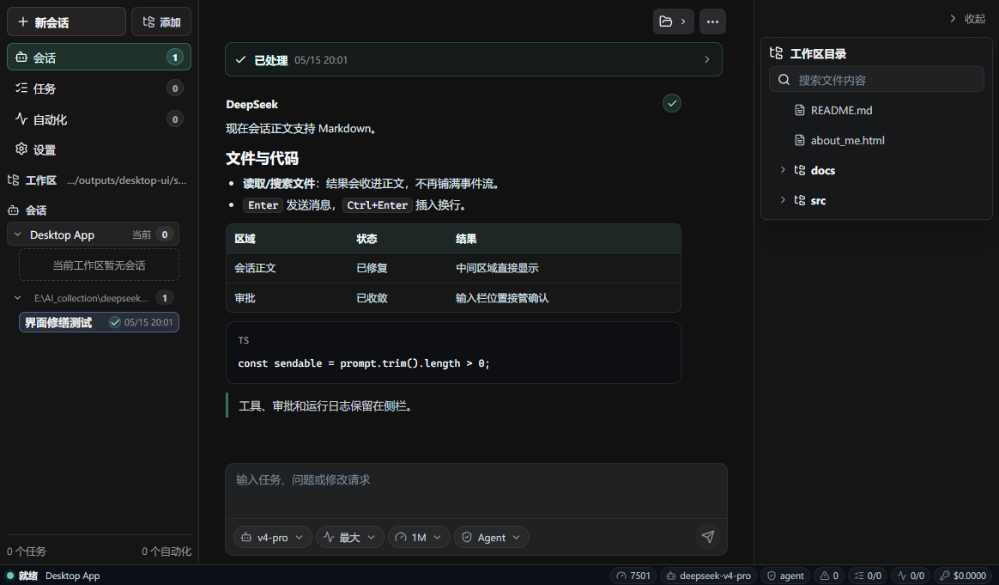

# DeepSeek App

DeepSeek App は Windows 向けのローカル AI エージェント用デスクトップワークベンチです。プロジェクト、スレッド、ストリーミング応答、ツール承認、タスク、自動化、MCP、スキル、使用量、ログを 1 つのデスクトップ UI にまとめます。



## Download

Windows x64 build is available from GitHub Releases:

- [DeepSeekAppSetup.exe](https://github.com/wzxnb2333/DeepSeek-App/releases/latest): installer.
- `DeepSeek App-win32-x64-0.1.0.zip`: portable ZIP. Extract it and run `deepseek-app.exe`.

## What It Does

- Keeps projects and threads separate.
- Shows final chat content in the main conversation area.
- Collapses reasoning, tool calls, and status events by turn.
- Shows tool approval near the composer.
- Uses Enter to send and Ctrl+Enter for a new line.
- Runs a local sidecar runtime with a random port and one-time token.
- Keeps provider keys out of renderer state, source code, screenshots, and release notes.

## Development

Requirements:

- Windows 10/11 x64.
- Rust 1.88 or newer.
- Node.js 20 or newer.
- Visual Studio Build Tools with C++ desktop workload and Windows SDK.

Build the runtime:

```powershell
cargo build --release --bin deepseek --bin deepseek-tui
```

Install desktop dependencies and start the app:

```powershell
npm --prefix desktop install
npm --prefix desktop run dev
```

## Package

```powershell
cargo build --release --bin deepseek --bin deepseek-tui
npm --prefix desktop run make:win
npm --prefix desktop run verify:make
```

Artifacts:

- `desktop\out\DeepSeek App-win32-x64\deepseek-app.exe`
- `desktop\out\make\squirrel.windows\x64\DeepSeekAppSetup.exe`
- `desktop\out\make\zip\win32\x64\DeepSeek App-win32-x64-0.1.0.zip`

## Notes

The first release targets Windows x64 only. The installer is not code-signed yet, so Windows may show a SmartScreen warning.
